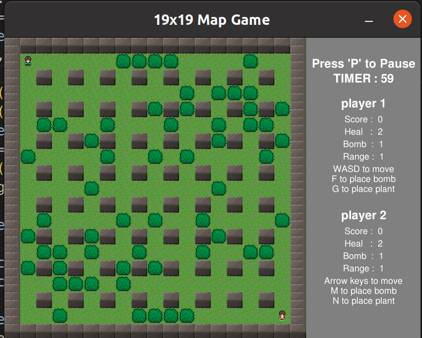
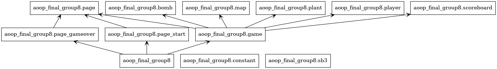
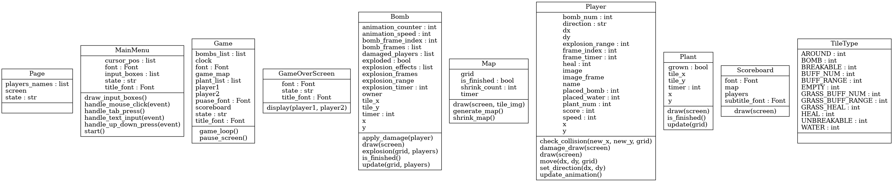

# Bomberman 轟炸超人


## 簡介
轟炸超人是一款非常經典的遊戲，已有40年的歷史。玩家需要穿越迷宮，用炸彈破壞障礙物，並通過策略性地放置炸彈擊敗敵人或其他玩家。

### 主要特點：
- 雙人模式：與朋友競爭
- 隨機環境：隨機地圖、隨機增益
- 新技能：除了傳統炸彈，現在玩家還可以製造障礙物

## 安裝
Clone the repository:

```sh
git clone git@github.com:lyj87/aoop_final_group8.git
```

Navigate to the project directory:

```sh
cd aoop_final_group8/
```

Install the required dependencies:

```sh
pip install pygame
```

Run the game (Windows):

```sh
python __init__.py
```

Run the game (Linux):

```sh
sudo python3 __init__.py
```

## 玩法
- 開始界面

  輸入玩家的名字，也可以不輸入任何內容。都輸入完成後，按 Enter 進入遊戲。
  
- 遊戲界面

  玩家一通過 WASD 控制角色移動，F 是放炸彈，G 是製造障礙物。

  玩家二通過上下左右鍵控制角色移動，M 是放炸彈，N 是製造障礙物。

- Game Over 界面

  按 R 可重新遊玩。
  按 P 回到開始界面。

## 類圖

### 類圖 1: 遊戲主套件結構


### 類圖 2: 類別結構



## 作者
TJKAI00  https://github.com/TJKAI00

lyj87  https://github.com/lyj87

## 授權
MIT

## 參考圖片
- https://opengameart.org/content/bomb-party-the-complete-set
- https://www.freepik.com/premium-vector/pixel-art-explosion-icon-retro-8-bit-style-burst-illustration-gaming-graphics_285202478.htm
- https://www.istockphoto.com/vector/vector-pixel-art-isolated-bomb-blast-gm1208336101-349219477
- https://kenmi-art.itch.io/cute-fantasy-rpg
- https://www.freepik.com/premium-vector/bomb-pixel-art-style_22989300.htm
- https://www.vecteezy.com/vector-art/24693834-pixel-art-heart-love-and-valentine

# statble baselines3

## 簡介

Stable Baselines3 是一個基於 Python 的開源深度強化學習框架，專為研究和應用強化學習（Reinforcement Learning, RL）算法而設計。它是由 OpenAI Baselines 專案演化而來的，並對程式碼結構進行了現代化和簡化，更易於擴展和維護的架構。

## 特點
- 多種算法支持：Stable Baselines3 提供多種主流強化學習算法的實現，包括 DQN、PPO、A2C、SAC、TD3 等，方便用戶快速上手和應用不同的算法。
- 易於使用：該框架旨在降低強化學習的入門門檻，通過簡單的 API，使用者可以快速定義和訓練模型。
- 模組化：架構設計模組化，允許用戶輕鬆擴展和自定義算法、環境、策略等。
